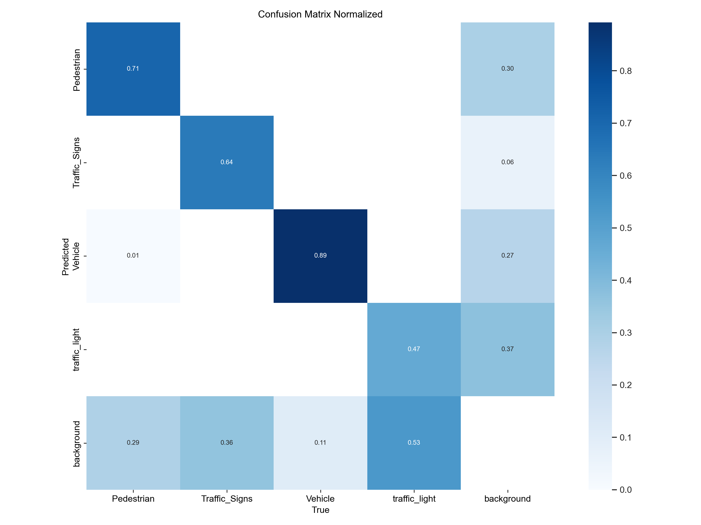
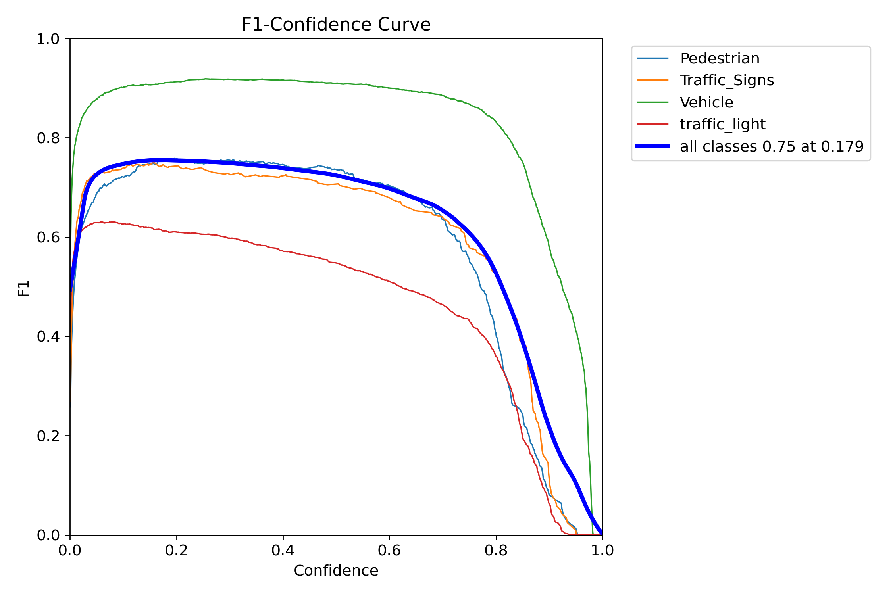
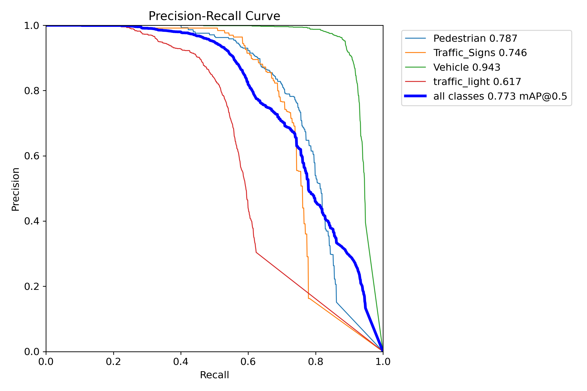
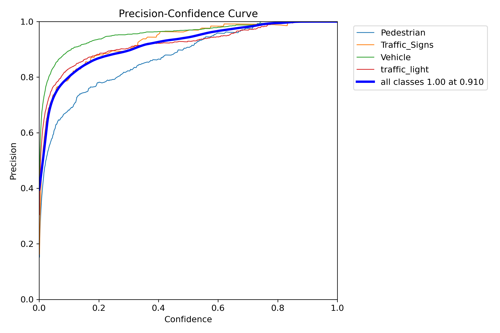
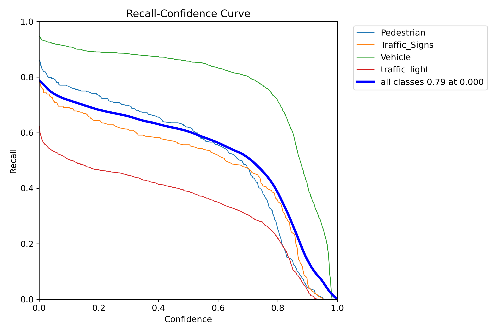
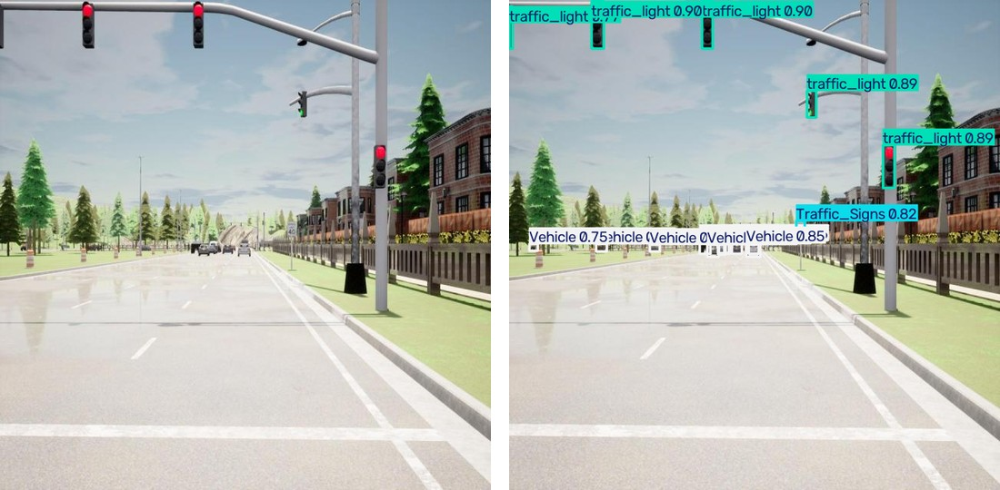
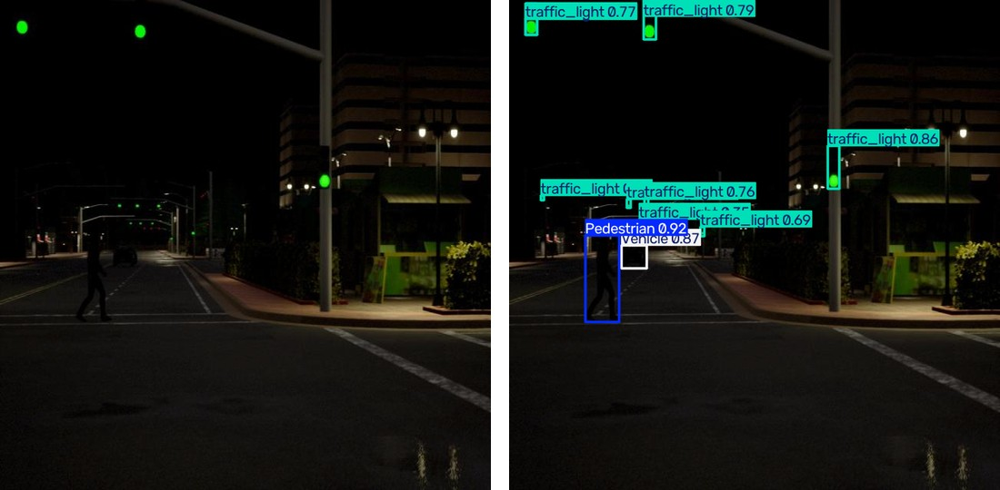

<p align="center">
  <h1>studienarbeit_repository</h1>
  <p>革新自动驾驶感知：面向 CARLA 仿真驾驶场景的 YOLOv11 系统化精度评测。</p>
  <p align="center">
    
    
    
    
  </p>
</p>

---

## 项目动机

> 自动驾驶技术的快速发展对目标检测系统的鲁棒性与可靠性提出了越来越高的要求。YOLO 等模型虽然展现出优异的性能，但它们在复杂动态环境（尤其是 CARLA 这类高保真仿真环境）中的真实表现往往缺乏全面、系统的评测。这一空白会导致边界场景（edge case）难以被及时发现，进而影响安全关键型自动驾驶系统的验证。

本项目填补了这一空白：构建了一套面向 CARLA 自动驾驶仿真器的 **YOLOv11 专用高保真评测框架**，在多种场景、光照条件与交通密度下系统性地评估 YOLOv11 的性能，输出可落地的优势与短板洞察，帮助开发者与研究人员精调模型、定位性能瓶颈，加速更安全高效的自动驾驶系统落地。

---

## 核心特性

*   🚗 **YOLOv11 深度集成**：采用最新一代实时目标检测模型，兼顾精度与速度，适配自动驾驶场景。
*   🎮 **CARLA 仿真环境**：在逼真、可定制的高保真 3D 仿真环境中完成评测，复现真实驾驶工况（雨天/晴天/夜间、多城镇）。
*   📊 **全面评测指标**：Precision、Recall、mAP@0.5、mAP@0.5:0.95、F1 以及推理延迟等深度性能洞察。
*   🖼️ **错误案例分析**：自动匹配漏检（FN）/误检（FP），输出混淆矩阵、典型案例可视化与原因分析。
*   📈 **精简训练管线**：内置 YOLOv11 在自定义数据集上的训练、验证 Notebook 与最终权重。
*   🛠️ **模块化可扩展架构**：灵活接入新数据集、新模型与新评测方法。
*   📋 **Allure 可视化报告**：pytest + allure 生成的交互式评测报告，指标断言即验收标准。

---

## 技术架构

| 技术 | 用途 | 关键优势 |
| :-------------- | :------------------------------------------ | :------------------------------------------------ |
| Python | 主要脚本与开发语言 | 生态丰富，AI/ML 库完善 |
| PyTorch | 深度学习框架（YOLO 后端） | 高效的模型训练与推理 |
| Ultralytics | YOLOv11 训练/验证/推理框架 | 完善的指标计算与可视化 |
| CARLA 0.9.13 | 高保真自动驾驶仿真器 | 真实传感器数据与动态场景测试 |
| pytest + Allure | 评测报告与验收看板 | 交互式报告、指标断言自动标红/标绿 |
| Roboflow | 数据集托管与版本管理 | 标注审核、格式导出（carla_labeling v5） |

## 仓库结构

```
studienarbeit_repository/
├── 📁 simulation/                       # CARLA 仿真：传感器套件、数据采集、YOLO 实时推理
│   ├── 📄 main.py                       # 入口：collect（数据采集）/ infer（实时推理）
│   ├── 📄 carla_world.py                # 仿真环境核心类（Town06、Tesla Model 3、NPC、天气）
│   ├── 📄 Sensor_Base.py                # 相机/雷达/超声波传感器封装
│   ├── 📄 YOLO_inference.py             # YOLO11m 推理与视频输出
│   └── 📁 configs/                      # 8 相机 + 1 雷达 + 12 超声波传感器配置
├── 📁 training/                         # 数据集下载与 YOLO11 训练
│   ├── 📁 Version_5_exp/YOLO_11/        # v11m / v11s / v11n 训练 Notebook 与结果
│   │   └── 📁 v11_m/train/weights/      # YOLO11m 最终权重（best.pt / last.pt）
│   ├── 📄 dataset.ipynb                 # Roboflow 数据集下载
│   └── 📄 requirements.txt              # 训练环境依赖
├── 📁 dataops/                          # 数据集整理与 GroundedSAM 自动标注
├── 📁 evaluation/                       # 评测框架
│   ├── 📄 eval_full.py                  # 整体指标 + 光照/天气场景分组评测
│   ├── 📄 error_cases.py                # 漏检/误检匹配与案例可视化
│   ├── 📄 generate_report.py            # 生成《算法精度评测报告》(Markdown)
│   ├── 📁 allure_report/                # Allure 测试用例（12 个，阈值即验收标准）
│   └── 📁 outputs/                      # 评测结果（指标 JSON/CSV、图表、报告）
├── 📁 docs/allure-report/               # Allure 报告静态站点（GitHub Pages 部署）
├── 📁 figures/                          # 传感器配置与检测效果图
├── 📄 《算法精度评测报告》.pdf           # 完整评测报告（PDF）
└── 📄 README.md
```

---

## 评测结果总览

> 模型：YOLO11m（`training/Version_5_exp/YOLO_11/v11_m/train/weights/best.pt`）
> 数据集：Carla_Labeling v5（train 4485 / valid 1274 / test 641，4 类）
> 协议：COCO 风格（imgsz=640, conf=0.001, IoU=0.6）

### 整体性能（测试集 641 张）

| mAP@0.5 | mAP@0.5:0.95 | Precision | Recall | F1 |
| :---: | :---: | :---: | :---: | :---: |
| **0.7732** | **0.5156** | 0.8608 | 0.6873 | 0.7545 |

### 逐类性能

| 类别 | Precision | Recall | F1 | mAP@0.5 | mAP@0.5:0.95 |
| :--- | :---: | :---: | :---: | :---: | :---: |
| Vehicle | 0.9315 | 0.8918 | 0.9112 | **0.9426** | **0.7769** |
| Pedestrian | 0.7645 | 0.7410 | 0.7525 | 0.7867 | 0.4747 |
| Traffic_Signs | 0.8710 | 0.6460 | 0.7419 | 0.7463 | 0.4411 |
| traffic_light | 0.8763 | 0.4705 | 0.6123 | 0.6174 | 0.3699 |

### 场景化分析（光照/天气）

| 场景 | 图片数 | mAP@0.5 | mAP@0.5:0.95 | Precision | Recall |
| :--- | :---: | :---: | :---: | :---: | :---: |
| 早晨/雨天（morning） | 230 | **0.7867** | **0.5634** | 0.9124 | 0.7028 |
| 夜间（night） | 325 | 0.7687 | 0.4916 | 0.8242 | 0.7023 |
| 正午/晴天（midday） | 86 | 0.7248 | 0.4592 | 0.8693 | 0.6254 |

### 可视化结果

**归一化混淆矩阵**

<p align="center"></p>

**F1 / PR / Precision / Recall 曲线**

<p align="center">
  
  
  
  
</p>

**检测结果示例（左：原图，右：YOLO11m 预测框，conf=0.25）**

<p align="center"></p>
<p align="center"></p>

---

## 📄 完整报告

📄 完整报告请见 [《算法精度评测报告》PDF](./《算法精度评测报告》.pdf)

📊 交互式可视化报告（Allure，含全部指标、图表与错误案例）：[Allure 报告](https://lyyxyy.github.io/studienarbeit_repository/allure-report/)

---

## 环境与安装

### 前置条件

*   **Python 3.8+**：运行全部脚本与 Notebook 所需。
*   **CARLA 0.9.13**：仿真环境（官方仅支持 Linux，详见 [CARLA 安装文档](https://carla.readthedocs.io/en/latest/install_carla/)）。
*   **pip**：Python 包安装器（随 Python 自带）。

### 安装步骤

1. **克隆仓库：**

    ```bash
    git clone https://github.com/lyyxyy/studienarbeit_repository.git
    cd studienarbeit_repository
    ```

2. **创建并激活虚拟环境（推荐）：**

    ```bash
    python -m venv venv
    # Windows
    .\venv\Scripts\activate
    # macOS / Linux
    source venv/bin/activate
    ```

3. **安装依赖：**

    ```bash
    pip install -r training/requirements.txt
    ```

4. **下载数据集（评测前置，数据集不随仓库分发）：**

    用 Roboflow API Key 运行 `training/Version_5_exp/download_dataset.py`，
    或参考 `training/Version_5_exp/dataset.ipynb` 从 Roboflow 下载 `carla_labeling` v5 数据集
    至 `training/Version_5_exp/Carla_Labeling-5/`。

5. **运行评测：**

    ```bash
    cd evaluation
    python eval_full.py                    # 整体指标 + 光照场景分组评测
    python error_cases.py                  # 漏检/误检分析与案例可视化
    python generate_report.py              # 生成 Markdown 评测报告
    ```

6. **生成 Allure 可视化报告：**

    ```bash
    cd evaluation
    python -m pytest allure_report/test_algorithm_evaluation.py --alluredir allure-results -v
    allure generate allure-results -o allure-report --clean   # 需安装 Allure CLI
    ```

7. **CARLA Python API 配置**（Linux，需先安装 CARLA 0.9.13）：

    ```bash
    export PYTHONPATH=$PYTHONPATH:/path/to/CARLA_0.9.13/PythonAPI/carla/dist/carla-0.9.13-py3.8-linux-x86_64.egg
    ```
    *请将 `py3.8` 与 `linux-x86_64` 替换为你实际的 Python 版本与系统架构。*

---

## 社区与治理

### 参与贡献

欢迎社区贡献！如果你想改进代码、新增特性或修复缺陷，请：

1. **Fork** 本仓库。
2. 为你的特性或修复**新建分支**：`git checkout -b feature/你的特性名` 或 `git checkout -b bugfix/问题描述`。
3. **修改代码**，并遵循项目的编码规范。
4. 用清晰、描述性的信息**提交**你的改动。
5. 将分支**推送**到你的 fork 仓库。
6. 针对本仓库 `main` 分支**发起 Pull Request**，并附上详细的改动说明。

### 许可证

本项目基于 **MIT 许可证** 开源，可自由使用、复制、修改、合并、发布、分发、再许可或出售副本，但须在副本或实质性部分中包含原始版权与许可声明。完整条款请参阅根目录的 `LICENSE` 文件。
