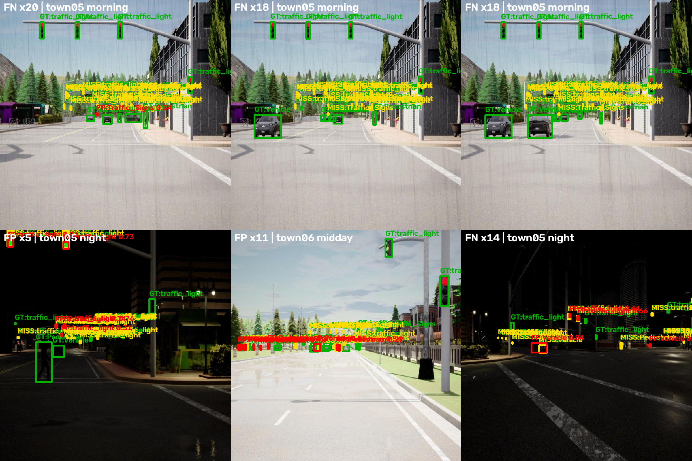
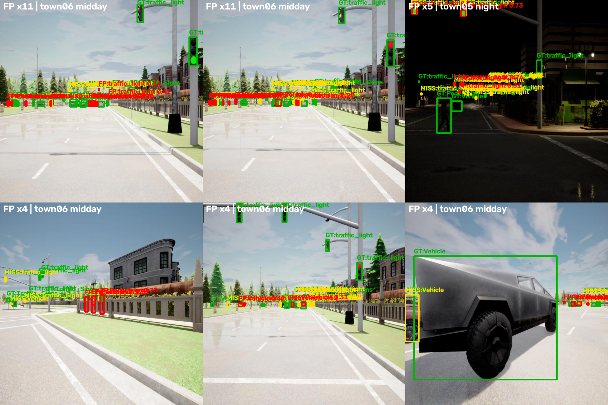

# 算法精度评测报告

> 项目: YOLO-Based Real-Time Object Detection for Autonomous Driving in CARLA (Studienarbeit)
> 模型: YOLO11m — checkpoint: `simulation/checkpoints/Yolo11m/best.pt`
> 数据集: Carla_Labeling v5 (Roboflow, MIT 许可), 测试集 641 张
> 报告生成日期: 2026-09-09

---

## 1. 评测设置

| 项目 | 值 |
|---|---|
| 模型 | YOLO11m (best.pt, 与 CARLA 实时推理集成所用 checkpoint 一致) |
| 数据集 | Carla_Labeling v5, 共 6400 张: train 4485 / valid 1274 / test 641 |
| 类别 | Pedestrian, Traffic_Signs, Vehicle, traffic_light (4 类) |
| 评测 split | test (641 张, 覆盖 6 个城镇, 3 种光照条件) |
| 评测参数 | imgsz=640, conf=0.001, iou=0.6 (COCO 风格 mAP), max_det=300 |
| 推理设备 | CPU (AMD Ryzen 7 8745HS, 8 线程), 无 GPU 加速 |
| 软件环境 | Python 3.8.15, PyTorch 2.4.1 (CPU), Ultralytics 8.3.13 |

> 注: 第 2/3 节指标按 COCO 标准协议 (conf=0.001, IoU 0.5:0.95) 计算;
> 第 4 节错误分析按部署推理阈值 conf=0.25 统计, 两者视角不同, 不可直接对比。

## 2. 整体性能 (测试集, 641 张)

| 指标 | 数值 |
|---|---|
| mAP@0.5 | 0.7732 |
| mAP@0.5:0.95 | 0.5156 |
| Precision (逐类均值) | 0.8608 |
| Recall (逐类均值) | 0.6873 |
| F1 (逐类均值) | 0.7545 |

### 2.1 逐类性能

| 类别 | Precision | Recall | F1 | mAP@0.5 | mAP@0.5:0.95 |
|---|---|---|---|---|---|
| Pedestrian | 0.7645 | 0.7410 | 0.7525 | 0.7867 | 0.4747 |
| Traffic_Signs | 0.8710 | 0.6460 | 0.7419 | 0.7463 | 0.4411 |
| Vehicle | 0.9315 | 0.8918 | 0.9112 | 0.9426 | 0.7769 |
| traffic_light | 0.8763 | 0.4705 | 0.6123 | 0.6174 | 0.3699 |

## 3. 场景化分析: 光照/天气条件

测试集文件名编码了采集时的天气预设 (仿真中 morning 预设为降雨, midday 为晴天, night 为夜间弱光),
据此将测试集按光照条件分组评测:

| 场景 | 图片数 | mAP@0.5 | mAP@0.5:0.95 | Precision | Recall | F1 |
|---|---|---|---|---|---|---|
| 正午/晴天 (midday) | 86 | 0.7248 | 0.4592 | 0.8693 | 0.6254 | 0.7186 |
| 早晨/雨天 (morning, 降水 90%) | 230 | 0.7867 | 0.5634 | 0.9124 | 0.7028 | 0.7808 |
| 夜间 (night) | 325 | 0.7687 | 0.4916 | 0.8242 | 0.7023 | 0.7500 |

### 3.1 场景与整体对比

| 场景 | mAP@0.5 | Δ (百分点) | mAP@0.5:0.95 | Δ (百分点) |
|---|---|---|---|---|
| 正午/晴天 (midday) | 0.7248 | -4.8 (整体 0.7732) | 0.4592 | -5.6 (整体 0.5156) |
| 早晨/雨天 (morning, 降水 90%) | 0.7867 | +1.3 (整体 0.7732) | 0.5634 | +4.8 (整体 0.5156) |
| 夜间 (night) | 0.7687 | -0.4 (整体 0.7732) | 0.4916 | -2.4 (整体 0.5156) |

## 4. 错误案例分析 (部署视角: conf=0.25, IoU=0.5)

以下基于整体评测保存的逐图预测, 按部署推理阈值 conf=0.25 与 GT 做 IoU>=0.5 同类匹配,
未匹配的 GT 记为漏检 (FN), 未匹配的预测记为误检 (FP)。
测试集 641 张中有 374 张存在漏检或误检。

### 4.1 逐类漏检/误检统计与 GT 尺度

| 类别 | GT 框数 | 漏检框数 (率) | 误检框数 (占该类预测比例) | GT 中位面积 (640 输入) | GT 极小目标占比 (<~14px) |
|---|---|---|---|---|---|
| Pedestrian | 332 | 97 (29.2%) | 62 (3.3%) | 0.0004 (约 12 x 12 px) | 60.8% |
| Traffic_Signs | 230 | 86 (37.4%) | 17 (1.5%) | 0.0001 (约 7 x 7 px) | 79.6% |
| Vehicle | 1377 | 154 (11.2%) | 64 (2.0%) | 0.0020 (约 28 x 28 px) | 30.4% |
| traffic_light | 1762 | 956 (54.3%) | 94 (2.6%) | 0.0001 (约 5 x 5 px) | 83.3% |

> 说明: GT 框尺度是该数据集的关键特征 —— 交通灯/标志/行人的中位标注面积仅相当于
> 640x640 输入下几个到十几个像素 (原图 1280x960 下约为其 2 倍)。
> 对于 10px 以下的目标, IoU@0.5 匹配对 1-2px 的定位偏差极其敏感,
> 因此统计出的"漏检"中一部分实际是定位略偏的检测。

### 4.2 归一化混淆矩阵 (ultralytics val 输出, conf=0.001)

要点: ① Vehicle 对角线值最高, 检测最稳定; ② traffic_light 向 background 的漏检块最大
(与该类仅 0.47 的 Recall 一致); ③ traffic_light 与 Traffic_Signs 之间存在双向混淆
(两类均为小尺寸高亮目标, 特征接近)。

### 4.3 主要混淆对 (误检预测 vs 最近 GT)

| 预测类别 | 疑似混淆来源 | 数量 | 类型 |
|---|---|---|---|
| traffic_light | traffic_light | 64 | 重复检测/定位偏移 |
| Pedestrian | 背景(无GT) | 40 | 纯误检 |
| Vehicle | Vehicle | 31 | 重复检测/定位偏移 |
| Vehicle | 背景(无GT) | 31 | 纯误检 |
| traffic_light | 背景(无GT) | 30 | 纯误检 |
| Pedestrian | Pedestrian | 21 | 重复检测/定位偏移 |
| Traffic_Signs | 背景(无GT) | 11 | 纯误检 |
| Traffic_Signs | Traffic_Signs | 6 | 重复检测/定位偏移 |

### 4.4 漏检典型案例 (黄色=漏检 GT, 绿色=正确匹配 GT)

| # | 图片 | 场景 | 概况 | 原因提示 |
|---|---|---|---|---|
| 1 | 4942_town_05_part_00_morning_front_narrow_jpg | town05 / morning | 32 GT, 20 漏检, 1 误检 | 极小目标 (640 输入下 <~14px); 极小目标 (640 输入下 <~14px); 极小目标 (640 输入下 <~14px) |
| 2 | 4977_town_05_part_00_morning_front_narrow_jpg | town05 / morning | 33 GT, 18 漏检, 0 误检 | 极小目标 (640 输入下 <~14px); 极小目标 (640 输入下 <~14px); 极小目标 (640 输入下 <~14px) |
| 3 | 4994_town_05_part_00_morning_front_narrow_jpg | town05 / morning | 33 GT, 18 漏检, 0 误检 | 极小目标 (640 输入下 <~14px); 极小目标 (640 输入下 <~14px); 极小目标 (640 输入下 <~14px) |
| 4 | 2996_town_05_part_00_night_front_narrow_jpg.r | town05 / night | 22 GT, 17 漏检, 5 误检 | 详见图片; 详见图片; 极小目标 (640 输入下 <~14px) |
| 5 | 1352_town_06_part_00_midday_front_narrow_jpg. | town06 / midday | 35 GT, 16 漏检, 11 误检 | 极小目标 (640 输入下 <~14px); 极小目标 (640 输入下 <~14px); 极小目标 (640 输入下 <~14px) |
| 6 | 3027_town_05_part_00_night_left_forward_jpg.r | town05 / night | 18 GT, 14 漏检, 4 误检 | 极小目标 (640 输入下 <~14px); 极小目标 (640 输入下 <~14px); 详见图片 |

### 4.5 误检典型案例 (红色=误检, 绿色=GT)

| # | 图片 | 场景 | 概况 | 原因提示 |
|---|---|---|---|---|
| 1 | 1326_town_06_part_00_midday_front_narrow_jpg. | town06 / midday | 32 GT, 10 漏检, 11 误检 | 极小目标 (640 输入下 <~14px); 与同类 GT 部分重叠 IoU=0.24, 属重复检测/定位偏移; 极小目标 (640 输入下 <~14px); 与同类 GT 部分重叠 IoU=0.37, 属重复检测/定位偏移; 极小目标 (640 输入下 <~14px); 与同类 GT 部分重叠 IoU=0.49, 属重复检测/定位偏移 |
| 2 | 1352_town_06_part_00_midday_front_narrow_jpg. | town06 / midday | 35 GT, 16 漏检, 11 误检 | 极小目标 (640 输入下 <~14px); 与同类 GT 部分重叠 IoU=0.43, 属重复检测/定位偏移; 小目标; 与同类 GT 部分重叠 IoU=0.44, 属重复检测/定位偏移; 极小目标 (640 输入下 <~14px); 与同类 GT 部分重叠 IoU=0.36, 属重复检测/定位偏移 |
| 3 | 2996_town_05_part_00_night_front_narrow_jpg.r | town05 / night | 22 GT, 17 漏检, 5 误检 | 小目标; 与同类 GT 部分重叠 IoU=0.35, 属重复检测/定位偏移; 极小目标 (640 输入下 <~14px); 与同类 GT 部分重叠 IoU=0.34, 属重复检测/定位偏移; 极小目标 (640 输入下 <~14px); 与同类 GT 部分重叠 IoU=0.37, 属重复检测/定位偏移 |
| 4 | 1151_town_06_part_00_midday_right_forward_jpg | town06 / midday | 13 GT, 6 漏检, 4 误检 | 与同类 GT 部分重叠 IoU=0.14, 属重复检测/定位偏移; 与同类 GT 部分重叠 IoU=0.15, 属重复检测/定位偏移; 与同类 GT 部分重叠 IoU=0.12, 属重复检测/定位偏移 |
| 5 | 1221_town_06_part_00_midday_front_wide_jpg.rf | town06 / midday | 27 GT, 13 漏检, 4 误检 | 极小目标 (640 输入下 <~14px); 与同类 GT 部分重叠 IoU=0.37, 属重复检测/定位偏移; 极小目标 (640 输入下 <~14px); 与同类 GT 部分重叠 IoU=0.49, 属重复检测/定位偏移; 极小目标 (640 输入下 <~14px); 置信度偏低 (0.31); 与同类 GT 部分重叠 IoU=0.32, 属重复检测/定位偏移 |
| 6 | 1401_town_06_part_00_midday_left_forward_jpg. | town06 / midday | 14 GT, 8 漏检, 4 误检 | 极小目标 (640 输入下 <~14px); 与同类 GT 部分重叠 IoU=0.26, 属重复检测/定位偏移; 极小目标 (640 输入下 <~14px); 与同类 GT 部分重叠 IoU=0.35, 属重复检测/定位偏移; 极小目标 (640 输入下 <~14px); 与同类 GT 部分重叠 IoU=0.31, 属重复检测/定位偏移 |

## 5. 结论与建议

### 5.1 主要结论

1. **整体性能达标**: YOLO11m 在测试集 (641 张) 上 mAP@0.5 = 0.7732, mAP@0.5:0.95 = 0.5156,
   精度 P = 0.8608, 召回 R = 0.6873。Vehicle 类表现突出 (mAP@0.5 0.9426 / F1 0.9112), 是实时集成的主力类别。
2. **瓶颈集中在小目标类**: traffic_light 是最大短板 (Recall 0.47, mAP@0.5 0.617),
   其次是 Traffic_Signs (Recall 0.65) 与 Pedestrian (Recall 0.74)。
   GT 尺度统计表明: 交通灯中位标注面积仅约 6x6 px (640 输入), 83.3% 的交通灯 GT 小于 14x14 px;
   交通标志中位约 8x8 px。远距离小目标是主要挑战; 且对极小框而言 IoU@0.5 匹配
   对 1-2 px 的定位偏差非常敏感, 统计出的漏检中有一部分实际是定位略偏的检测。
3. **错误模式清晰**: 部署阈值 (conf=0.25) 下, 374/641 (58.3%) 的图片存在漏检或误检。
   漏检几乎全部为极小/远距离目标 (交通灯 956 框、车辆 154 框);
   误检以同类重复检测为主 (与 GT 部分重叠 IoU 0.1-0.5 的二次检测框),
   纯误检次之 (行人 40 框等), 误检框置信度集中在 0.25-0.55 区间。
4. **场景差异显著且方向出人意料**: 雨天/早晨 (morning) 分组反而最优
   (mAP@0.5 0.7867, 高于整体 +1.3pp); 晴天正午 (midday) 最差 (0.7248, -4.8pp),
   其中行人 Recall 骤降至 0.43, 推测为强阳光导致的阴影/高对比度使小目标更难以分辨;
   夜间 (night) 居中 (0.7687) 但精确率最低 (0.8242), 弱光下误检增多,
   交通灯 mAP@0.5:0.95 降至 0.3246。
   注: 三个分组在城镇/相机构成上不完全均衡且 midday 仅 86 张, 场景差异可能部分来自内容分布而非纯光照因素。

### 5.2 改进建议

1. **提高训练分辨率**: 原图 1280x960, 建议 imgsz>=960 (理想 1280), 小目标面积放大 2.25-4 倍,
   预期对 traffic_light / Traffic_Signs / Pedestrian 改善显著。
2. **小目标专项增强**: 高分辨率微调 + 小目标 copy-paste 增强; 可考虑带 P2 浅层检测头的变体或 SAHI 切片推理。
3. **标注质量复核**: 复核面积 <0.0005 的极小 GT 框与同一目标的重复框 (直接影响指标可信度)。
4. **推理后处理**: 部署 conf 从 0.25 提升至 0.35-0.5 可大幅削减低置信度误检;
   可对 traffic_light 单独提高阈值; 收紧类内 NMS 以减少重复检测框。
5. **场景专项**: 补充正午强光/阴影数据与夜间负样本挖掘, 抑制夜间误检。

---

*报告由 evaluation/eval_full.py + error_cases.py + generate_report.py 自动生成, 可在装有数据集与 checkpoint 的环境复现。*
